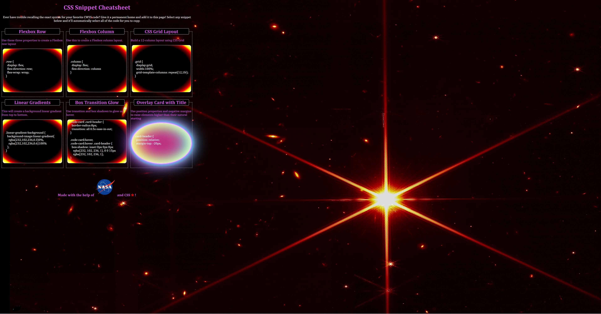
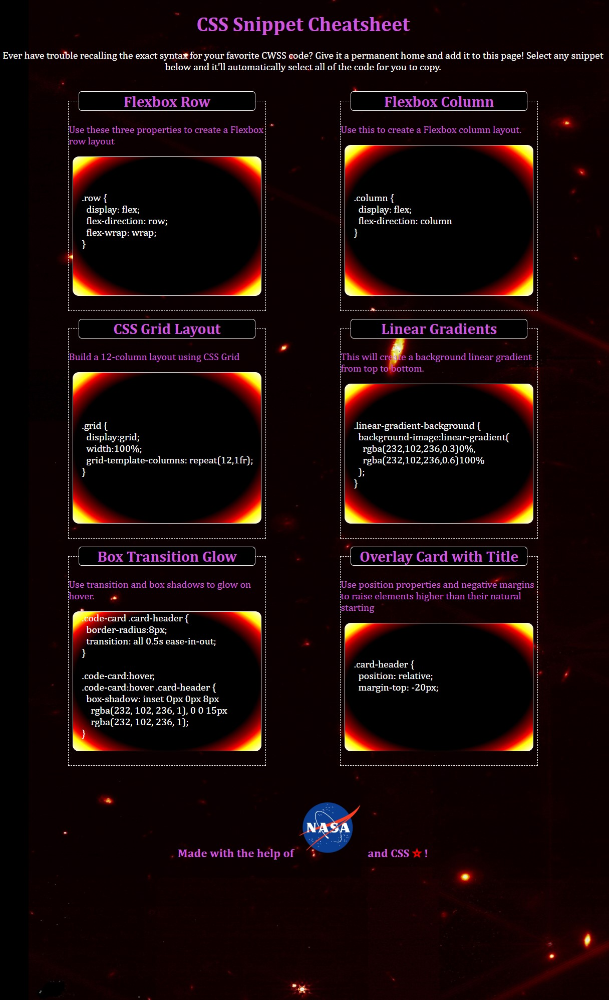
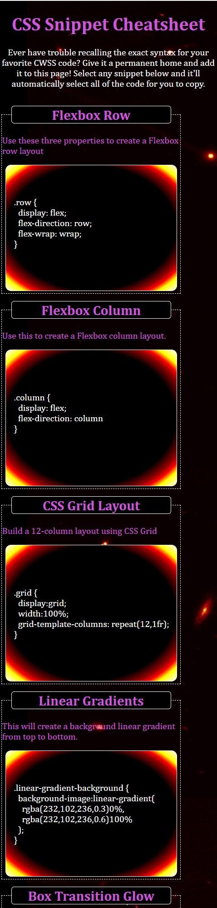

# CSS-Snippets

CSS Snippet Cheatsheet

## Description 

This sight intends to provide a examples of how CSS can be used to dynamically format a webpage while offering some snippets to tryout for yourself.  Now if you are struggling to remember one of these more complex codes they are just a click away.

## Examples 

The source code may provide a deeper insight and more thorough examples of what CSS can do.

  * Use of the root psuedo-class.
```md
:root {
    --white-text: white;
    --border-rad: 5px;
    --header-width: 280px;
    --card-width: 314px;
    --code-width: 300px;
    background-color: black;
    background-image: url(https://www.nasa.gov/sites/default/files/thumbnails/image/telescope_alignment_evaluation_image_labeled.png);
    background-size: 3840px 2009px;
    background-repeat: no-repeat;
    background-position-y: -200px;
    background-position-x: 50px;
}
```

  * The ability to select text with a single click of the mouse.

```md
.code-select {
    color: white;
    user-select: all;
}
```

  * Just hover to enjoy some flashy dynamic content!

```md
.code {
    display: flex;
    flex: 1 1 auto;
    margin-bottom: 10px;
    border-radius: 10px;
    width: var(--code-width);
    margin-left: auto;
    margin-right: auto;
    align-items: center;
    background-image: radial-gradient(
        black 70%,
        darkred 80%,
        red 85%,
        yellow 90%,
        white 100%
    );
    transition: all 0.2s ease-in-out;
}
```
```md
.code:hover {
    border-color: white;
    border-radius: 100%;
    box-shadow: 0 0 6px 3px white,
                0 0 10px 5px magenta,
                0 0 14px 9px cyan,
                inset 0px 0px 50px white,
                inset 20px 0 80px yellow,
                inset -20px 0 80px cyan,
                inset 20px 0 300px magenta,
                inset -20px 0 300px orange,
                0 0 50px white,
                -10px 0 80px magenta,
                10px 0 80px cyan;
                transition: all 0.2s ease-in-out;
    cursor:grab;
}
```


Visit: https://blec333.github.io/css-snippets/ to review the deployed page.


## Usage 

This is a landing page for use in advertising the services available for Horisean clients.


### Final Product






Deployed Application
https://blec333.github.io/css-snippets/

Github Repository
https://github.com/Blec333/css-snippets


## Acknowledgements


©Brennan LeClair

©Caitlin Lindauer
